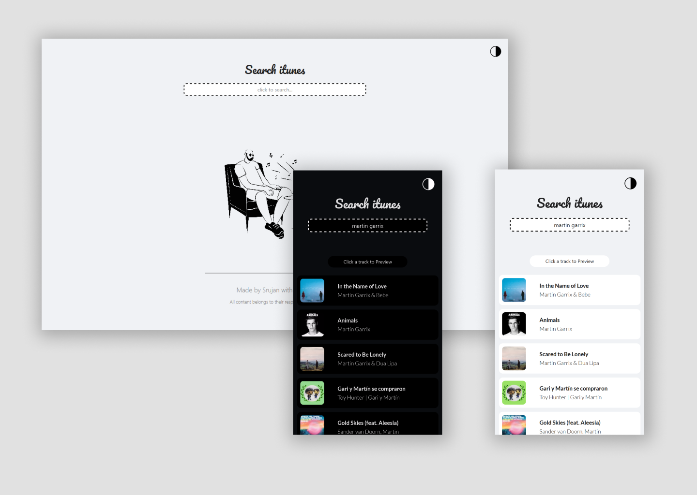

# Search itunes

A song preview application that uses itunes api to fetch data.

🔗 **Link:** https://search-itunes.netlify.app/

[](https://github.com/tterb/atomic-design-ui/blob/master/LICENSEs)
## Screenshots

<center>

</center>
  
## Installation

```bash
git clone https://github.com/Royal-lobster/searchitunes

cd searchitunes

npm install
```
## Running the Application

```bash
npm start
```
    
## Authors

- [@SrujanGurram](https://www.github.com/royal-lobster)

  
## License

[MIT](https://choosealicense.com/licenses/mit/)

  
